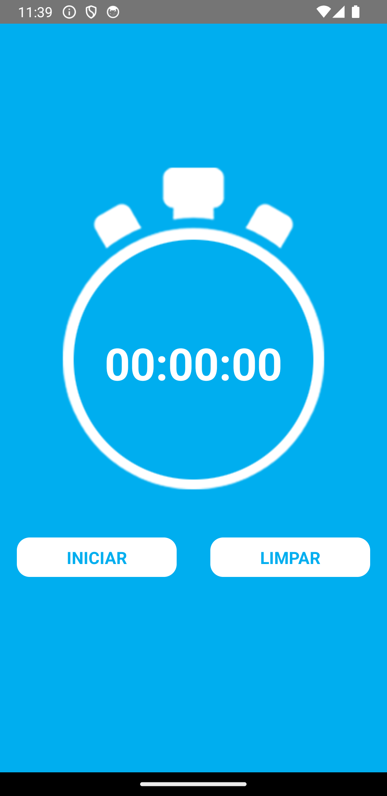
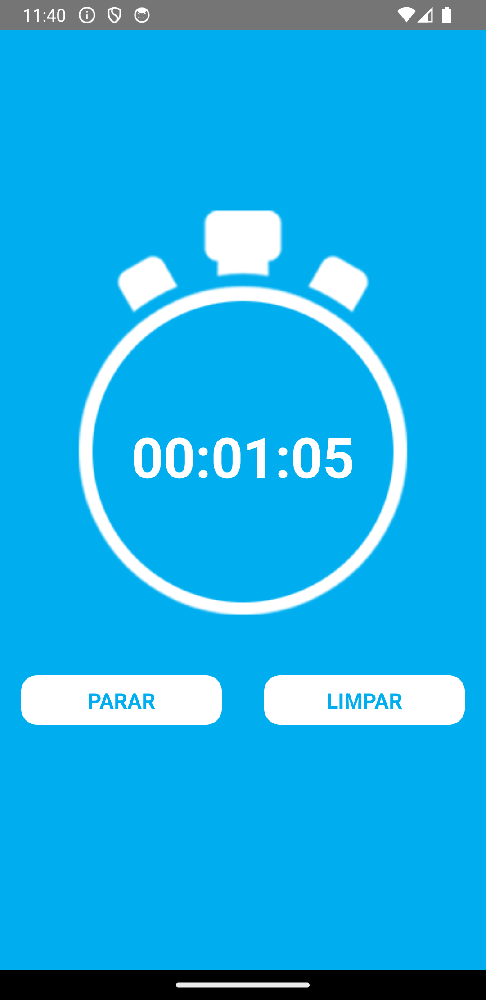
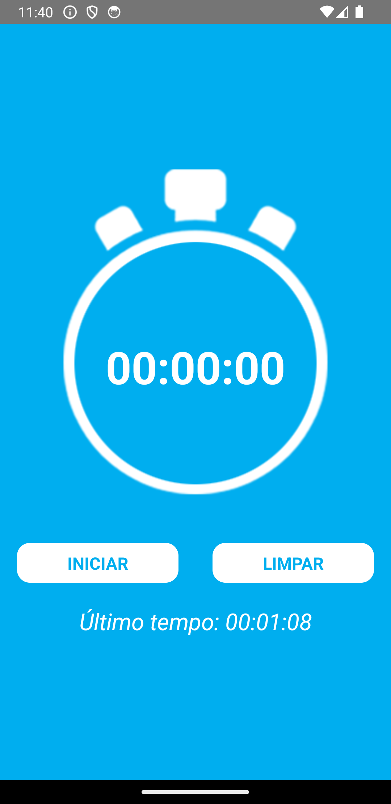

# Real-Timer App

## Purpose

- The main purpose of this project is to create a real-time timer application using React Native. This app allows users to start a timer, which displays elapsed time in real-time. Users can also pause the timer and reset it.

## Timer Preview

### Screenshot:

  
  <br>
  <br>
  
  <br>
  <br>
  

## Technologies Used

- React Native
- CLI
- React Native Hooks
- Custom Timer Logic

## How to Use

### Clone the repository to your local machine:

```bash
git clone git@github.com:FranciscoVieir/Timer-app.git
```

### Access the folder

```bash
cd timerApp
```

## Install dependencies:

```bash
npm install
```

#### or

```bash
yarn start
```

## Availble Scripts

In the project, directory, you can run the following scripts:

- npm run start or yarn start: Starts the CLI development server.
- npm run android or yarn android: Runs the app on an Android emulator/simulator.
- npm run ios or yarn ios: Runs the app on an iOS simulator.
- npm run eject or yarn eject: Ejects the app from CLI, if needed.
